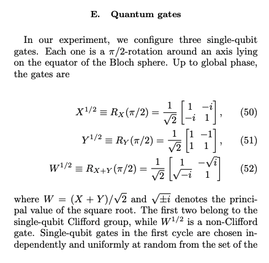

## Day 1 - 3/31, 4/3, 4/5
* Set up with IBM Q and Qiskit
* Hello World Demo
    * [Tutorial on Qmunity](https://www.qmunity.tech/tutorials/hello-world-in-qiskit)
    * [Video on Qiskit channel](https://www.youtube.com/watch?v=RrUTwq5jKM4)

### Notes
* Error with circuit
* Cannot connect with API

## Day 2 - 4/6
* Contacted Tim about Hello World demo error
    * Error in regards to system type (Unix is fine)

### *Robin's computer charger breaks... and lockdown continues* 💻  &nbsp; 😢

## Day 3 - 4/14 
* Reading about [Google’s research](https://www.nature.com/articles/s41586-019-1666-5) *again*
* Looking at Tim’s [lectures on quantum circuits](https://www.youtube.com/watch?v=J8blNmEL28k&list=PLo0Vs5tDeRLTT2sdtt7zoWWB6KOgpnXxo&ab_channel=NYUQuantumTechnologyLab)

### *Found computer charger ... and lockdown continues* 💻  &nbsp; 🥲

## Day 4 - 4/21
* Clarifying understanding of Google’s circuits

* "Every cycle includes a layer each of single- and two-qubit gates. The single-qubit gates are chosen randomly from {𝑋‾‾√,𝑌‾‾√,𝑊‾‾‾√}, where  𝑊=(𝑋+𝑌)/2‾√ and gates do not repeat sequentially. The sequence of two-qubit gates is chosen according to a tiling pattern, coupling each qubit sequentially to its four nearest-neighbour qubits. The couplers are divided into four subsets (ABCD), each of which is executed simultaneously across the entire array corresponding to shaded colours. Here we show an intractable sequence (repeat ABCDCDAB); we also use different coupler subsets along with a simplifiable sequence (repeat EFGHEFGH, not shown) that can be simulated on a classical computer. b, Waveform of control signals for single- and two-qubit gates." [source](https://www.nature.com/articles/s41586-019-1666-5#Sec4)

* In-depth, alternative approaches to explaining Google article:
    * [Stack-exchange: *What did exactly Google do in simulating a random quantum circuit on a classical computer in supremacy experiment?*](https://quantumcomputing.stackexchange.com/questions/11617/what-did-exactly-google-do-in-simulating-a-random-quantum-circuit-on-a-classical)
    * [Medium: Quantum Supremacy — Google Sycamore Processor](https://jonathan-hui.medium.com/quantum-supremacy-google-sycamore-processor-6f30073a17fa)
    * [Understanding Google's “Quantum supremacy using a programmable superconducting processor” (Part 3): sampling](https://quantumcomputing.stackexchange.com/questions/8342/understanding-googles-quantum-supremacy-using-a-programmable-superconducting-p)
* Looked at [random circuit generation function of Qiskit library](https://qiskit.org/documentation/stubs/qiskit.circuit.random.random_circuit.html) and [found location of generating random circuits](https://qiskit.org/documentation/_modules/qiskit/circuit/random/utils.html)
* What does it mean to sample from a random circuit?  / Quantum supremacy process
    * [Sampling random quantum circuits: a pedestrian’s guide](https://arxiv.org/pdf/2007.07872.pdf)
* Looking at quantum complexity??
    * Query Complexity
        * [Understanding Quantum Algorithms via Query Complexity](https://arxiv.org/pdf/1712.06349.pdf%5D) 
        * [Quantum Computational Complexity](https://cs.uwaterloo.ca/~watrous/Papers/QuantumComputationalComplexity.pdf)
        * [Detailed Account of Complexity for Implementation of Circuit-Based Quantum Algorithms](https://www.frontiersin.org/articles/10.3389/fphy.2021.731007/full)


### Notes
* Random number generation =/= pseudo random number generation
* Sampling refers to picking a possible outcome from the probability distribution and getting the probability of that outcome
* Google samples x qubit strings from the output probability distribution of x qubit circuit. Then their goal is run an algorithm that computes that chosen x sample as much as possible from the probability distribution of x qubit string.
* High level code of what Google did:
```
for seed in numInstances:
    circuit = generateCircuit(seed)
    qDist = quantumExecution(circuit)
    cDist = classicalSimulation(circuit)
```
*where if ```qDist ≈ cDist``` then the quantum processor is accurate.*

## Day 5 - 4/27
* [Refer to supplementary information by Google](https://static-content.springer.com/esm/art%3A10.1038%2Fs41586-019-1666-5/MediaObjects/41586_2019_1666_MOESM1_ESM.pdf)
* Named X, Y gates but what one-two qubit gates specifically?
    * [Stack Exchange: *Understanding Google's “Quantum supremacy using a programmable superconducting processor” (Part 1): choice of gate set*](https://quantumcomputing.stackexchange.com/questions/8337/understanding-googles-quantum-supremacy-using-a-programmable-superconducting-p)
* Demonstrating quantum supremacy close analysis, in math, [see this](https://arxiv.org/pdf/2007.07872.pdf)
    * ```pv(|x>) = pu(x) = |<a1a2...an|u>|^2 = |<x|u>|^2```
    * ...The probability, given a quantum circuit defined by the unitary operator ```U```, of observing the basis state ```|x>``` (or bitstring x)
    * In other words, to sample a *quantum circuit* is to evolve the circuit with a unitary operator ```U```, then measure each qubit in the resulting system to obtain a bitstring ```x```. By sampling bitstrings we can obtain ```pu(x)``` for each bitstring.
    * If random, then each circuit is independent random variable. Probability obtaining S is Pr(S) [see p.2](https://arxiv.org/pdf/2007.07872.pdf).
    * Since quantum supremacy is based on comparing classical and quantum, we also need to analyze the probability that this sampling task can occur on a *classical computer*. Simulate a measurement on the outputs and obtain a *classically obtained bitstring*. Represented by ```Pr(Scl)``` [see p.3](https://arxiv.org/pdf/2007.07872.pdf).
    * To demonstrate quantum supremacy, show a measurable difference between ```Pr(S)``` and ```Pr(Scl)```.
        * What is the measurable difference?
            * Say if we give our classical algorithm more resources and/or increase the error rate in our quantum circuit, there is a point where probabilities converge. 
            * Say if we make the error rate of quantum circuit low enough, we can observe a difference. That is represented by *m* [see p.4](https://arxiv.org/pdf/2007.07872.pdf).
        * "If your quantum circuit is good enough - that is the per gate error rate is low and you perform the sampling experience...you can find on average ```log(Pr(S) - logPr(Scl)) ≈ m```, difference we should see between quantum circuit and classical simulation. 

### Notes
* ```sqrt(X)```, ```sqrt(Y)``` gates belong to the single-qubit [Clifford group](https://en.wikipedia.org/wiki/Clifford_gates) while ```sqrt(W)``` is a non-Clifford gate that uses ```sqrt(X)+sqrt(Y)```.
* **Found implementation of [```sqrt(X)``` gate](https://qiskit.org/documentation/stubs/qiskit.circuit.library.SXGate.html#qiskit.circuit.library.SXGate), [github of sx gate](https://github.com/Qiskit/qiskit-terra/blob/7bc7f08bf64aa686694467e8f8be551e0b740213/qiskit/circuit/library/standard_gates/sx.py); however, no implementation of ```sqrt(Y)``` gate.**
* Google implements a pseudo-random quantum circuit of *circuit of depth 20 with 430 2-qubit and 1113 1-qubit gates*, note implmentation will be incomplete 

### References
* As per [Google's supplementary information](https://static-content.springer.com/esm/art%3A10.1038%2Fs41586-019-1666-5/MediaObjects/41586_2019_1666_MOESM1_ESM.pdf)<br></br>
 
* [Qiskit SX Gate Code](https://github.com/Qiskit/qiskit-terra/blob/7bc7f08bf64aa686694467e8f8be551e0b740213/qiskit/circuit/library/standard_gates/sx.py)
* [Qiskit X Gate Code](https://github.com/Qiskit/qiskit-terra/blob/7bc7f08bf64aa686694467e8f8be551e0b740213/qiskit/circuit/library/standard_gates/x.py)
* [Qiskit Y Gate Code](https://github.com/Qiskit/qiskit-terra/blob/7bc7f08bf64aa686694467e8f8be551e0b740213/qiskit/circuit/library/standard_gates/y.py)
* [Qiskit Gates](https://qiskit.org/textbook/ch-states/single-qubit-gates.html) 
* [Qiskit Standard Circuit Library](https://qiskit.org/documentation/apidoc/circuit_library.html)
* [Qiskit Entire Gates Library Code](https://github.com/Qiskit/qiskit-terra/tree/7bc7f08bf64aa686694467e8f8be551e0b740213/qiskit/circuit/library/standard_gates)

## Day 6 - 4/28